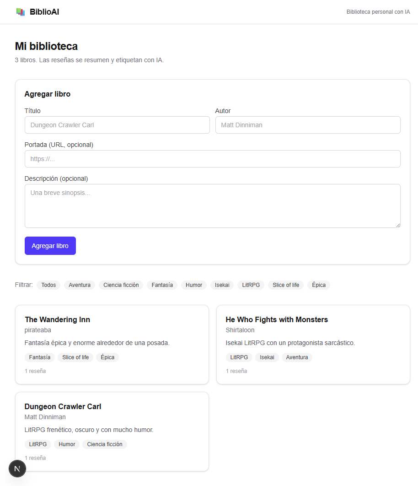
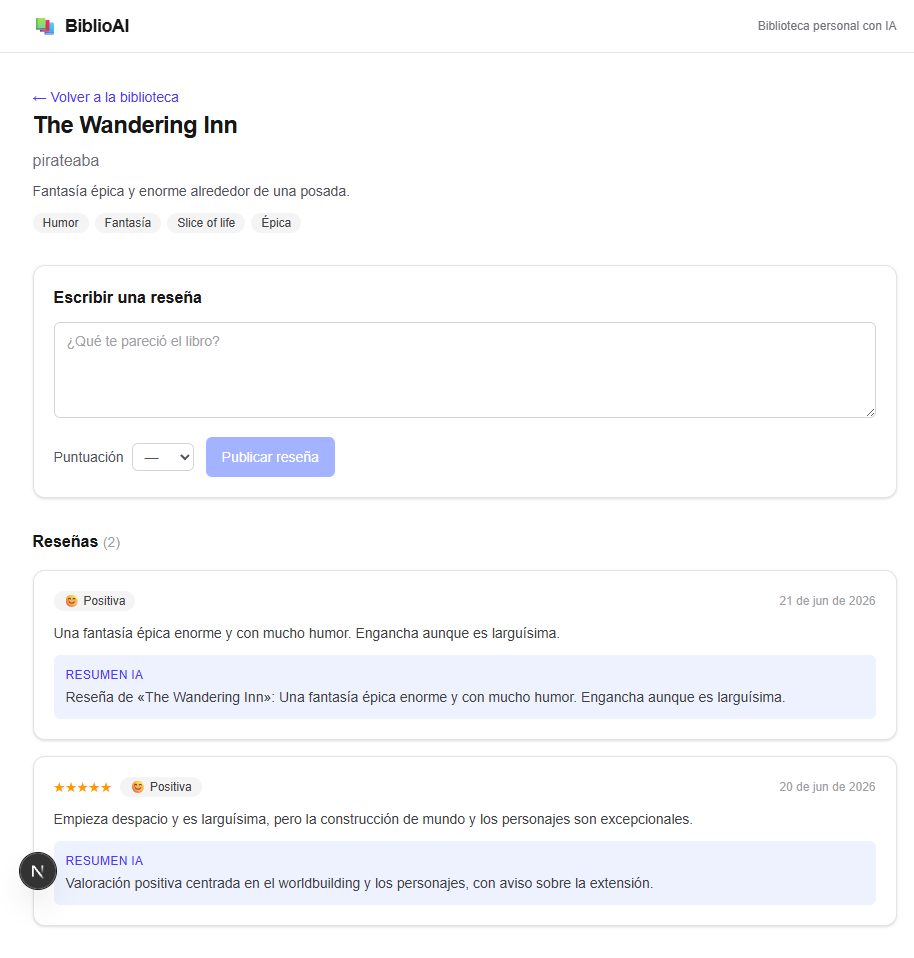

# 📚 BiblioAI

> Gestor de biblioteca personal con análisis de reseñas asistido por IA.


BiblioAI es una aplicación full stack para gestionar tu biblioteca personal:
catalogás libros, escribís reseñas, y un modelo de lenguaje (Claude) genera
automáticamente un **resumen**, **etiquetas/géneros** y un **análisis de
sentimiento** de cada reseña, que después podés usar para buscar y filtrar.

Además, para cada libro podés subir un **PDF de estudio** y la IA genera un
**resumen** y un **mapa conceptual** a partir de su texto (elegís qué generar).

> ⚠️ Proyecto de portfolio. El foco está tanto en el producto como en las
> **prácticas de ingeniería**: arquitectura modular, validación estricta, tests,
> CI/CD y documentación. Ver [`docs/`](./docs).

## 📸 Capturas

| Biblioteca                                  | Detalle del libro con reseñas + IA    |
| ------------------------------------------- | ------------------------------------- |
|  |  |

## ✨ Características

- 📖 CRUD de libros y reseñas (crear, editar y borrar)
- 🤖 Resumen, etiquetado y sentimiento de reseñas con IA (Claude vía Agent SDK; mock por defecto)
- 📑 Material de estudio: subís un PDF y la IA genera un **resumen** y un **mapa conceptual** (elegís uno, el otro o ambos)
- ⚡ Insumo a la IA optimizado: se descartan páginas de ejercicios y se recorta el texto para gastar menos tokens y tardar menos
- 🔎 Búsqueda por título/autor/etiqueta y filtrado por etiquetas generadas
- ✅ Validación de extremo a extremo con Zod
- 🧪 Tests unitarios (Vitest) y end-to-end (Playwright)

> 🔐 La autenticación de usuarios está en el roadmap (hoy se usa un usuario demo
> del seed). Ver [Estado del proyecto](#estado-del-proyecto).

## 🛠️ Stack

| Capa           | Tecnología                                        |
| -------------- | ------------------------------------------------- |
| Framework      | Next.js 16 (App Router) + TypeScript estricto     |
| UI             | React 19 + Tailwind CSS (componentes propios)     |
| Validación     | Zod                                               |
| Base de datos  | Prisma + SQLite (dev) / PostgreSQL (prod)         |
| Extracción PDF | unpdf                                             |
| IA             | Claude Agent SDK (suscripción) · mock por defecto |
| Tests          | Vitest (unitarios) + Playwright (E2E)             |
| Calidad        | ESLint + Prettier                                 |
| Autenticación  | Auth.js (NextAuth) · _planeado_                   |
| CI/CD          | GitHub Actions · _planeado_                       |
| Infra          | Docker + docker-compose · _planeado_              |

## Estado del proyecto

Proyecto de portfolio en construcción. Estado actual:

**Hecho**

- ✅ CRUD de libros y reseñas (incluye editar y borrar)
- ✅ IA de reseñas: resumen, etiquetas y sentimiento (mock + Claude)
- ✅ Material de estudio: subida de PDF, resumen y mapa conceptual con opciones
- ✅ Preprocesado del texto para la IA (descarte de ejercicios + recorte)
- ✅ Búsqueda y filtrado
- ✅ Tests unitarios (Vitest) y E2E (Playwright)

**Pendiente (roadmap)**

- ⬜ Autenticación real con Auth.js (hoy: usuario demo del seed)
- ⬜ CI con GitHub Actions (typecheck + lint + tests)
- ⬜ Docker / docker-compose y despliegue con PostgreSQL

## 🚀 Quickstart

Requisitos: Node.js 20+ y npm.

```bash
# 1. Clonar e instalar
git clone https://github.com/SebastianFont/biblioai.git
cd biblioai
npm install

# 2. Configurar variables de entorno
cp .env.example .env
# Por defecto AI_PROVIDER=mock: funciona sin credenciales.
# Para IA real, poné AI_PROVIDER=claude (usa tu sesión de Claude Code).

# 3. Preparar la base de datos (migración + datos de ejemplo)
npm run db:migrate
npm run db:seed

# 4. Levantar en desarrollo
npm run dev
```

Abrí [http://localhost:3000](http://localhost:3000).

## 📜 Scripts

| Script               | Descripción                     |
| -------------------- | ------------------------------- |
| `npm run dev`        | Servidor de desarrollo          |
| `npm run build`      | Build de producción             |
| `npm run test`       | Tests unitarios (Vitest)        |
| `npm run test:e2e`   | Tests end-to-end (Playwright)   |
| `npm run lint`       | Linter (ESLint)                 |
| `npm run format`     | Formatea el código con Prettier |
| `npm run typecheck`  | Chequeo de tipos sin emitir     |
| `npm run db:migrate` | Aplica migraciones de Prisma    |
| `npm run db:seed`    | Carga datos de ejemplo          |

> Para los tests E2E, instalá una vez los navegadores: `npx playwright install chromium`.
> Corren contra una base SQLite propia que se migra y siembra sola; la IA queda en modo `mock`.

## 📂 Estructura

```
src/
├── app/            # Rutas: páginas (UI) y API (route handlers)
├── components/     # Componentes de UI reutilizables
├── lib/
│   ├── ai/         # Capa aislada de integración con el LLM
│   ├── db/         # Cliente Prisma y queries
│   ├── pdf/        # Extracción de texto de PDF y preprocesado para la IA
│   └── validators/ # Esquemas Zod (única fuente de verdad de tipos de entrada)
├── server/         # Lógica de negocio (services)
└── types/          # Tipos compartidos

e2e/                # Tests end-to-end con Playwright
```

Cada carpeta documenta su responsabilidad en un `README.md` propio.

## 📚 Documentación

- [Arquitectura y decisiones técnicas](./docs/ARCHITECTURE.md)
- [Referencia de la API REST](./docs/API.md)
- [Cómo se usó la IA en este proyecto](./docs/AI_USAGE.md)

## 📄 Licencia

MIT — ver [LICENSE](./LICENSE).
